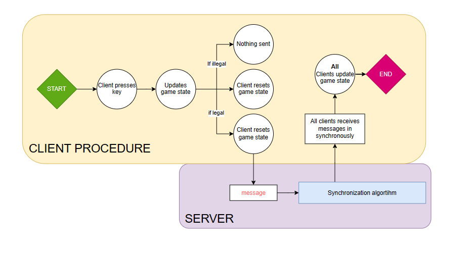
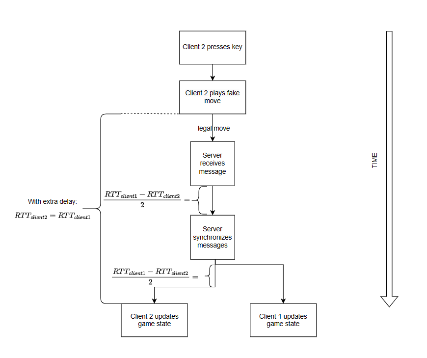
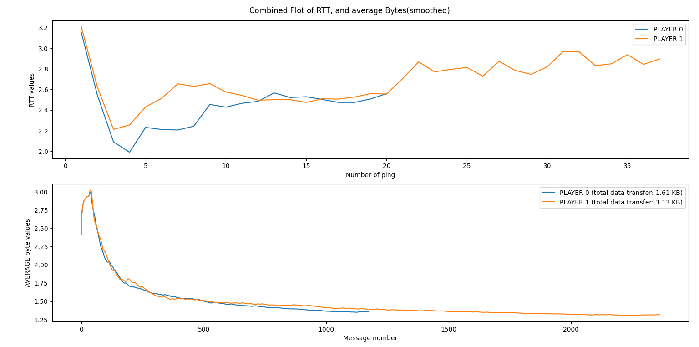
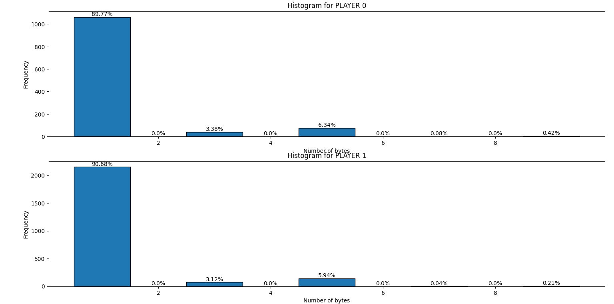

# Documentation on the Synchronized Gaming Protocol(SGP)
## Introduction
I have been working on this protocol(based on TCP) for a while now, and it has endured quite a lot. I started with a protocol
in which each client plays a move on his own device, immediately changing their own game state. Only after the client himself 
has played the move, would it be sent to the server. This is all well and good, if the ping time is low. But 
in scenario's where one player has a very low ping time, while the other has a very high ping time, the (supposedly) same 
game would look totally different on their screens. One way to resolve high latency is by saving a buffer
at the server and if he sees a big mismatch he 'corrects' the game states of the players.

One can code this 'buffering/interpolating' system in a very sophisticated manner so that the other clients
wouldn't notice anything for decent pings. But I wanted to have a robust, and very low (application-layer) data transfer 
working protocol which works decent for pings in the range of 70-120 ms, and does _not_ buffer the game state of the
clients. 

To do this, I have made use of two, rather 'weird', concepts; the **fake moves**, and 
the concept of **echoing your own move** to be able to synchronize the screens of all players over different locations.
I will start with these two concepts, and the synchronization algorithm I have constructed, whereafter I will continue
on the specific message codes.


## Echoing your own moves
This is probably a weird concept, but to synchronize screens, there needs to be a way to restrict each player of changing 
the game state on their own screen. This is done by letting each player send their own move they want to play
to the server. This server then internally sends this message to all other clients _such that all messages
will come synchronously on each client's screen_ by comparing the RTT's. More about this in section 
'Synchronization algorithm'. The server has a more administration role, but does not do any validity checks, 
because each client only send legal moves and moves by which a fruit is taken by the concept of the 'fake move'.

## 'Fake Moves'
Each client only changes his real positions after it has been echoed back from the server. But if we would like
to only receive legal moves of the client as a server, we introduce the _fake move_. When the player presses on a
key, the move is played on the board, the client's code checks at the game state, and looks if the move results in an
illegal move or one by which a fruit is taken. After this check is done, the player resets the game state on his screen.
In this way, if the move the player wants to play is illegal, no data is sent to the server, thus the player also doesn't get
anything echoed back: as this is the _only_ way to 'really' change his position, the player's position doesn't change.
If with this fake move the client picks up a fruit, then he sets in his message to the server the right ID(namely 6) to 
notify the server that it has picked up a fruit. The server then sends to _all_ player's the new fruit update, and 
the client which have taken the fruit while taking into account the synchronization Algorithm. 

The following flowchart represents nicely the combination of the fake move and the echo move:



## Synchronization Algorithm
The calculation is done as follows:
There is created a list of the clients based on their RTT, in descending order(this is "sorted_clients_on_RTT").
The max RTT is also fetched out. To synchronize the screens of the different clients, we first send the person with the biggest RTT(call it RTT_{max}).
After this, the second highest RTT(call it RTT_{2}) client is being sent the message after there has been waited for
(RTT_{max} - RTT_{2})/2(dividing by two because RTT is two-way, but we only consider the one-way in this case). 
If there is also a third client, then we also take the RTT of this one(RTT_{3}). To synchronize this one, we let the program wait again,
but now for (RTT_{2} - RTT_{3})/2 ms. In this way, client 3 and 2 would get (ideally) at the same time the message, but
because client 2 and 1 too (ideally) would get the message at the same time; all clients get it at the same time!

Apart from this, we also need to take into the account the fact that the customer 'echoes' back their own position to the
server to be able to play it. In this case, if client 1 has a high ping, but client 2 a low one, then client 2 will get a faster
response to his moves compared to the positions that client 1 gets from himself. This essentially makes
client 2 faster; undermining our 'fair game protocol'! To account for this, we need to 'slow down' the faster clients.
This is done by delaying the message of the faster client by the difference in time it takes the _slowest_ client
to send a position to the server.

Let's go through an example to make this clear. Suppose we have two clients. Client 1 and Client 2. Suppose that
the RTT of these clients are as follows:
<ul>
    <li>Client 1 has a ping of 100 ms(quite high)</li>
    <li>Client 2 has a ping of 2 ms(very low)</li>
</ul>
If Client 2 wants to make a move. He first checks that his own move is legal(by a 'fake move'), he sends
the legal move to the server in approximately 2/2 = 1 ms. Because we want to have the 'echo time' of his own move
equal to the echo time of Client 1(which is 100ms), we need to add already (100-2)/2 = 49 ms to his route. By doing
this we have already slowed down Client 2 down by a bit to which is seemed that the message took 50 ms to get 
to the server, and not 1 ms(thus equal to what it would take Client 1). After this slowdown, 
we send the messages back. To do this, we construct the sorted
list of clients based on their RTT in descending order. Because Client 1 has a high RTT(100 ms), his message will
be send as first. Then, as to synchronize the two screens of the players, the message to Client 2 needs to wait 
another 49 ms. After these 49 ms, the message is sent and after 1 ms, it reaches Client 2, ideally
at the same time as Client 1. In this way, Client 2 sees the same thing as Client 1, while having the same 'echoing'
time. This can be visually shown as follows:



There needs to be noted that this way of dealing is still an approximation of the reality, because the ping can
change. So in reality, they still may not see the exact same thing on their screen at exactly the same time. But at 
least they would differ from eachother by only a virtue of a few milliseconds.

One could argue that it's no good to punish the player with the better connnection by slowing him down. But 
I find this the best way to handle the high RTTs. Because would this not been handled, then the player with the 
higher RTT would have a tremendous amount of advantage in this setup; because in our 'echoing move system' it would 
take 100 ms for Client 1 to play a move, while this is 2 ms for Client 2, wouldn't there be any correction on speed!


### Message identification method
Our protocol works upon TCP, to get the reliable data transfer that it needed for the pinging, as well for the initialization
of our game. For the communication part, the protocol works on three
important principles: the msg ID, and the player ID, and the direction.
<ul>
    <li>
        The msg ID: this is the identifier of the messages that
        is sent between server and client. There are 6 different type of messages.
        These will be elaborated further on.
    <li>
        To identify each client, there is need for a unique identifier(ID). In this protocol,
        it is only made possible to handle 4(which corresponds to 2 bits) clients.
    </li>
    <li>
        The other three bits will contain the direction of the movement. This 
        data element will be mostly send between client and server. After this section, we will do some analytics concerning
        the average byte send/received by the server<->client(s).
</ul>
Combining these three elements, we get our 1 byte header:

       0     1     2     3     4     5     6     7
    +-----+-----+-----+-----+-----+-----+-----+-----+
    |    Message ID   | Player ID |    Direction    |
    +-----+-----+-----+-----+-----+-----+-----+-----+
   
We will start by discussing each type of msg ID.


## Message ID explanation

### Message ID 1: assigning ID
A message ID of 1 is *only* sent by the Server to assign the 
client an ID. In this case, there is no data sent, thus the message
has the following form:

       0     1     2     3     4     5     6     7
    +-----+-----+-----+-----+-----+-----+-----+-----+
    |  0     0     1  | Player ID |   0    0     0  |
    +-----+-----+-----+-----+-----+-----+-----+-----+

This message is sent immediately after the client has joined the server. After 
the client receives this, he remains idle until the other clients joins.


### Message ID 2: probing process + starting game
Once all clients are connected to the server. The server starts the _probing process_. This means
that the server starts sending pings to all clients, and calculates(+saves) the _average_ RTT's/ping time of each client.
The number of probing pings can be chosen, we have chosen this as 20. After each client has received and sent back
the ping, the server sends to all clients the message to start the game. 
The msg ID is equal to 2(010 in bits). The field 'player_ID' is in this case not used to send the player ids, because a 
message with id 2 is created by the server, which has no player id. This 2-bit field will be in this case used to notify
the clients on how many players there will be. With these two bits, the player can be notified:
<ul>
    <li>
        n_of_opp=1: client will know that there is only one opponent. The other opponent blocks will not be drawn.
    </li>
    <li>
        n_of_opp=2: each client will know that there are 2 opponents. The other opponent blocks will not be drawn.
    </li>
    <li>
        n_of_opp=3: each client will know that there are 3 opponent. All opponent blocks will be drawn.
    </li>
</ul>
The header field 'direction' will for this purpose be used to modulate the
speed of the game. If we have lower RTTs, then it suffices that the moveSpeed of the players are low. Because of 
the low RTT the echoing will be faster, so the game too. If the RTT is high, then it would take much longer(due 
to longer waiting on echoing) to play a move. Therefore the 'real' speed would lower. To account for this, we
use the direction field in these type of messages as a _speed modulator_. There are three 'gears':
<ul>
<li>Gear 1: If the max RTT is lower than 40 ms, then the move speed will be 0.4</li>
<li>Gear 2: If the max RTT between 40 ms and 80 ms, then the move speed will be 0.6</li>
<li>Gear 3: If the max RTT is higher than 80 ms, then the move speed will be 0.8</li>
</ul>

       0     1     2     3     4     5     6     7
    +-----+-----+-----+-----+-----+-----+-----+-----+
    |  0     1     0  | n_of_opp  | speed modulator |
    +-----+-----+-----+-----+-----+-----+-----+-----+

To be able to start the game, there is need to
<ul>
    <li>
        Starts the clocks of each client. Because the RTT's are different, we can't just send 40 000 ms, but we 
        would need to send (40 000 - $\frac{RTT_{client}}{2}$) ms. With this, all clients will start (ideally) with
        the same amount of time on their clocks. Because the game lasts only for 40 000 ms, to spare some bits, we
        we only need to save the time module 2^{16} = 65536. If we get a negative remainder, we simply add the 
        calculated RRT by 65536. We thus only need 2 bytes for the time management.
    </li>
    <li>
        The first fruit position needs to be sent too. Because the screen is 1280 on 600, there will be need for 
        11 and 10 bits for resp. the x and y position. We will give each position two bytes.
    </li>
</ul>

With these two points, the data contains 3*2 bytes = 6 bytes, and looks as follows:

       0     1     2     3     4     5     6     7
    +-----+-----+-----+-----+-----+-----+-----+-----+
    |                                               |
    +                 TIME STAMP                    +
    |                                               |
    +-----+-----+-----+-----+-----+-----+-----+-----+
    |                                               |
    +               fruit x position                +
    |                                               |
    +-----+-----+-----+-----+-----+-----+-----+-----+
    |                                               |
    +               fruit y position                +
    |                                               |
    +-----+-----+-----+-----+-----+-----+-----+-----+

Thus the server sends a request of 1(header) + 6(data) = 7 bytes, if the message id is equal to 2.

### Message ID 3: position change of player
This message will be created by the client if their player makes a move. The structure of this request can take 
two forms:
<ul>
    <li>
        If the player keeps a key pressed, then only the _direction_ will be sent. This direction contains 
        3 bits, and there are 5 possibilities:
        <ul>
            <li>1: The player goes upwards</li>
            <li>2: The player goes to the right</li>
            <li>3: The player goes downwards</li>
            <li>4: The player goes to the left</li>
            <li>5: The player stands still</li>
        </ul>
        In this type of msg ID, there is no data. So only the 1-byte header will be sent. This is very important
        as this will be the message that is sent the most. Later on, the analysis will follow on the average byte
        that the server receives of the clients.
    </li>
    <li>
        If we would only send the relative positions, then small errors could be accumulating. Even though
        we try to make the two screens as synchronized as possible, there still can be a small deviation
        between the real RTT, and the estimated one. To correct the little error in position, we send
        the _exact_ position of the player every time he presses a new key. The x position of the player is 
        11-bit, and the y-position 10 bit. Therefore the data consists of 4 bytes:
        
           0     1     2     3     4     5     6     7
        +-----+-----+-----+-----+-----+-----+-----+-----+
        |                                               |
        +               player x position               +
        |                                               |
        +-----+-----+-----+-----+-----+-----+-----+-----+
        |                                               |
        +               player y position               +
        |                                               |
        +-----+-----+-----+-----+-----+-----+-----+-----+
</ul>


### Message ID 4: leaving message
These type of messages are used by the client to notify the other players. In this case, the client sends only the header,
with the message ID equal to 4, but the other fields left empty. The client sends in case he wants to
leave the game following ('universal') message:

       0     1     2     3     4     5     6     7
    +-----+-----+-----+-----+-----+-----+-----+-----+
    |  1     0     0  | 0      0  |   0    0     0  |
    +-----+-----+-----+-----+-----+-----+-----+-----+


The server gives the ids to the clients, and keeps in mind which client has which id assigned. In this way, when
a client wants to leave the game, the server adds his assigned ID to this message, and sends it to the remaining clients.
This request would look like follows:

       0     1     2     3     4     5     6     7
    +-----+-----+-----+-----+-----+-----+-----+-----+
    |  1     0     0  | LeavingID |   0    0     0  |
    +-----+-----+-----+-----+-----+-----+-----+-----+

If the number of players is equal to 2. Then the remaining player will automatically win the game. If there are 
more than 1 player left, the remaining players will will continue playing. Furthermore, the left player will be 
assigned a (LEFT) mark beside their on all other screens.


### Message ID 5
This message is the ping message, and is very similar to message ID 2, but it does not contain the fruit positions. 
This means that these type of messages are as follows:


       0     1     2     3     4     5     6     7
    +-----+-----+-----+-----+-----+-----+-----+-----+
    |   1    0     1  | Player ID |  0     0     0  |
    +-----+-----+-----+-----+-----+-----+-----+-----+
    |                                               |
    +                 TIME STAMP                    +
    |                                               |
    +-----+-----+-----+-----+-----+-----+-----+-----+

Similarly, the time stamp is calculated in modulo 65536, so that we have a 16-bit time stamp.

The pinging is done in two phases, in each a different way:
<ul>
    <li>
        Before the game starts, the _average_ RTT is estimated for each client. 
    </li>
    <li>
        After the game starts, the ping messages are sent at different moments for each clients. The aim is 
        to update the ping every 100 ms. This means that for each client, the ping message must be send 
        after they have sent $\max(100//(average RTT), 70)$. The max is taken into account if the ping would be 
        higher than 200 at the start of the game, then it can still be updated later on, would the ping get better.
    </li>
</ul>


### Message ID 6: updating position and fruit
This type of message is a little bit different for client and server. Each client checks for himself if he took
a fruit(see section 'Fake move'). If it takes a fruit, then he sends the header of 1 byte to the server:

       0     1     2     3     4     5     6     7
    +-----+-----+-----+-----+-----+-----+-----+-----+
    |   1    1     0  | Player ID |     direction   |
    +-----+-----+-----+-----+-----+-----+-----+-----+

WITH the data, which are his positions. This can be: a directional change, or an absolute position. The change in the
data is that the first has only the header(1 byte), while the absolute one has the player positions too(in total 5 bytes).

In case it's an absolute displacement, the data has following structure:

       0     1     2     3     4     5     6     7
    +-----+-----+-----+-----+-----+-----+-----+-----+
    |                                               |
    +               player x position               +
    |                                               |
    +-----+-----+-----+-----+-----+-----+-----+-----+
    |                                               |
    +               player y position               +
    |                                               |
    +-----+-----+-----+-----+-----+-----+-----+-----+

The Server reads that he has gotten a message with id 6, and thus updates the position of the fruit, and 
sends to all clients the following message:


If it is an absolute displacement(9 bytes)

       0     1     2     3     4     5     6     7
    +-----+-----+-----+-----+-----+-----+-----+-----+
    |   1    1     0  | Player ID |  0     0     0  |
    +-----+-----+-----+-----+-----+-----+-----+-----+
    |                                               |
    +               player x position               +
    |                                               |
    +-----+-----+-----+-----+-----+-----+-----+-----+
    |                                               |
    +               player y position               +
    |                                               |
    +-----+-----+-----+-----+-----+-----+-----+-----+
    |                                               |
    +               fruit x position                +
    |                                               |
    +-----+-----+-----+-----+-----+-----+-----+-----+
    |                                               |
    +               fruit y position                +
    |                                               |
    +-----+-----+-----+-----+-----+-----+-----+-----+

If it is a directional change in position, then it only consists of 5 bytes:

       0     1     2     3     4     5     6     7
    +-----+-----+-----+-----+-----+-----+-----+-----+
    |   1    1     0  | Player ID |    direction    |
    +-----+-----+-----+-----+-----+-----+-----+-----+
    |                                               |
    +               fruit x position                +
    |                                               |
    +-----+-----+-----+-----+-----+-----+-----+-----+
    |                                               |
    +               fruit y position                +
    |                                               |
    +-----+-----+-----+-----+-----+-----+-----+-----+

To give a clear visualisation of how many bits every type of message has, following table is very helpful:


       Msg             BYTE AMOUNT
       ID 
    +-----+-----------------------------------------+
    |   1 |                1                        |
    +-----+-----------------------------------------+
    |   2 |                7                        |
    +-----+-----------------------------------------+
    |   3 |     1(rel.)    |         5(abs.)        |
    +-----+-----------------------------------------+
    |   4 |                1                        |
    +-----+-----------------------------------------+
    |   5 |                3                        |
    +-----+-----------------------------------------+
    | 6(s)|     5(rel.)    |         9(abs.)        |
    | 6(c)|     1(rel.)    |         5(abs.)        |
    +-----+-----------------------------------------+
Where "rel." represents the case in which only the direction is sent. The "abs." refers to the absolute position
being sent through. In case of the message ID of 6, the server additional adds the fruit's x and y position. Thus 
the number of bytes between the message from the client(c) is different from the message with ID 6 the server(s) sends.


## Visualisation, and performance of SGP
Now that the technical details are covered, it is time to look into the performance, and byte rate of this protocol.
The number of bytes is saved every time a server receives a message, or sends a message; this saving is done for each 
client. The following plot gives the RTT during the game in function of the number of ping messages. There is also given
the average byte that is being sent or received by the server:


The game was played with two clients, both on my own local machine. This means that one player 'remained idle'. So this plot
shows the average byte sent, with only one client consistently moving.

First of all, we see that the RTT(in ms) is pretty stable(as long as a client remains 
idle, no unnecessary pinging is done, so the graph stops at 20 for the idle client). This is not that 
surprising because both clients are playing on the same machine, on which the server is running too.

The more interesting part comes into play when we look at the average byte send from
client to server. We see in the plot that for the beginning, the two graphs are the same;
both clients are being pinged in the same way. After the pining is done(the number of 
probing pings are 20), the game starts. We immediately see that the average byte value 
is decreasing very fast, the more messages there are created. For this, we
can look at the distribution of the messages for this particular game, given in following histogram:

We see that 90% of the messages have one byte, this is exactly the message with ID equal to three, and in which only
the relative position displacement is given(only 1-byte header sent).

The messages of byte 3 corresponds
to the ping messages(header(1byte) + time stamp(2 bytes)). The pinging only happened
40 times of all the messages, 20 in the beginning, and 20 during the game itself. 

The 5 byte messages correspond to the messages which also has an ID of 3, but in this case
the absolute position is sent through, which is 1 byte for header, and 4 bytes for 
data; thus 5 bytes. Note that there are also the update of fruits that can count
5 bytes(if displacement is relative, thus only header 1 byte and 4 bytes fruit pos. update), but 
this is only a relative small fraction($\approx 1%$), to make it easier, we neglect this.

As is seen in the histogram, the 5-byte messages are only 5-7% of the moves. 
And this also shows that my initial thought that only giving the direction 
seem to work out. In this geometry: lines are the shortest path to the fruit(unless there
is a wall). So for best gameplay, you should take a minimal amount of turn. The fewer turns
there are, the fewer absolute positions will be sent through. With the presented calculations, there
is thus a $\frac{0.9}{0.06} \approx 15$; on average the same key is pressed during a period of 15 messages,
before we take a turn.

The 7 byte corresponds to the Initialization message with ID 2. Because this only
happens once, its frequency is very low.

The 9 byte messages are the messages in which the fruit changes position, and
we sent an absolute position of the player. This would mean that right at the moment the player
makes a turn, he also takes a fruit. Because in the most cases we continue in the straight line
after the fruit is taken, we only very sporadically send a 9 byte message.

From the graph of the average byte value send/received, we can already see that this 
goes to _1.25 byte_.
The average byte sent during the whole game can be calculated with the histogram for player 0
as:

$$E[byte] = 1\cdot0.8977 + 3\cdot0.0338 + 5\cdot0.0634 + 7\cdot 0.0008 + 9\cdot 0.0042= 1.3595$$

Hence, on average in our whole game, the byte value of for each message was 1.36 bytes.

Finally, the total bytes _EXTRA bytes as application data_ that was sent between each client and the server, was also
kept track off, and this is incorporated in the legend of the average byte plot. This
is 3.13 kilobytes for the moving client. For the idle client, this is 1.61 kilobytes, which
is to be expected because he himself doesn't play any move, but each move of the other
client is sent to him to update his screen. For the moving client, we have twice as much, because
in this protocol there was made use of 'echo moves', so the client sends a message, and the server
sends it synchronously with the other client back to him. But nonetheless, we seem to approach a
minimum of (extra) data transfer; 1 byte!

## Further refinement, problems to assess
As no protocol is perfect, neither is mine. So in this section, we will give a short 
description on the things in which this protocol might fail, and other things this protocol does
not provide yet.
<ul>
    <li>
        To start with, the synchronization of the clocks; this is only done in the beginning 
        of the game. This synchronization is done by using the probing RTTs that were done 
        before the game started. But these are estimations, so you will always get an error margin, but
        the thing is that because we, as humans, have a reaction time of approximately 100 ms, this time difference
        won't be that quickly noticed. 
        The more problematic situation is when the device of one client has a different
        time scale: it counts faster/slower than the other client's device. I personally thought that this won't 
        give the biggest problems, as we are only working on small-time scales. But would this protocol be 
        used for larger time scales, then this point must be definitely kept in mind.
    </li>
    <li>
        Secondly, this protocol is a synchronous protocol, but also one that punishes the players with the
        better connection. In a two client game, this is not really that bad, because it wouldn't be a game
        if one could play very fast, but the other one's move would come way too late in, due to the latency.
        This problem becomes certainly a point of notice if you have multiple clients, and if only one player 
        has a high RTT. The speed modulation still gives some space for pings up to 100 ms, and even 150-170 ms of ping, 
        to make the game still playable. But for pings higher than this, the game is not playable at all. 
        One way of trying to solve this is by declining players which try to connect for which
        estimated ping times are higher than 200 ms. The rejected player can get a 'leave the game' message in this case.
        This message would have an ID of 7. This was not implemented in the protocol yet.
    <li>
    This protocol works on TCP. Because the average bytes send for this protocol is very low(nearly 1 byte), the 
    large 'header' of TCP seems to be kind of 'compensated'. A way of optimizing this is by combining UDP and TCP. TCP would be used
    to initialize the game, and fruit updates(as these are important to get through). Thus for message ID's 1, 2
    and 6. 
    The best optimization would be in the messages which have one bit. If we send these through with UDP, we
    would have an certainly better protocol that has fewer data transfer(this time too accounting the transport layer's bytes)
    between client and server. This is certainly something to look further into.
    </li>
</ul>


## Extra
### Usage, server
For the server, the port and host-name are obligatory. There are also two optional
parameters there can be given; the number of players the server supports, and
if the plotting of the collected data should be shown or not.
More compactly:
```
python Server.py  "<port>" "<host>" "<[OPTIONAL]n_of_player(default 2)> <[OPTIONAL]plot? (y/n)(default: 'n')>
```
As an example, if the server supports 3 players, and you want to let it show the plots,
then the following would need to be given(port is as 8112 chosen):
```
python Server.py 8112 0.0.0.0 3 y
```
If you only want to start up the server, with the default values:
```
python Server.py <port> <host>
```

### Usage, client + additional ping simulating
For the client, the port and host-name are obligatory. There can be added a 
_additional ping_ with the client through the third parameter for testing. If left empty, then
there will not be simulated an extra latency. Thus we get for the usage:

```
 python network_game.py <port> <host> <[OPTIONAL]additional ping(in ms)>
 ```

This latency is created by delaying the message by the given simulated ping time by every
time a player receives a message. Note that in our protocol this 
can be done, because the player's own move gets echoed back.


# Author
Burak Kucuktopal


